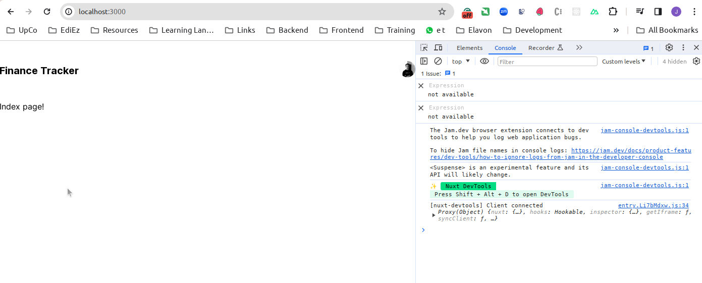

# Master Nuxt 3 - Full Stack Complete Guide - Financial

In this document, we will create a Financial website using Nuxt 3 based on the [Master Nuxt 3 - Full-Stack Complete Guide
](https://www.udemy.com/course/master-nuxt-full-stack-complete-guide) Udemy Course.

- We are going to use [Nuxt UI](https://ui.nuxt.com/), [headless UI](https://headlessui.com/) and [Supabase](https://supabase.com/docs/).

## 1. Create a new project

### 1.1. Create the Nuxt 3 project

- We are going to use Bun to proceed with the creation of the project. Bun is a CLI tool that helps you create Nuxt 3 projects.

```bash
juanpabloperez@jpp-PROX15-AMD:~/Work/Projects/EdiEz/Examples$ bunx nuxi@latest init nuxt3-ts-portfolio

✔ Which package manager would you like to use?
bun
◐ Installing dependencies...                                                                                                                     18:29:30
bun install v1.0.23 (83f2432d)

 + nuxt@3.9.3
 + vue@3.4.15
 + vue-router@4.2.5

warn: nuxt-app's postinstall script took 1.7s

 670 packages installed [7.07s]
✔ Installation completed.                                                                                                                       18:29:37

✔ Initialize git repository?
No
                                                                                                                                                 18:29:43
✨ Nuxt project has been created with the v3 template. Next steps:
 › cd nuxt3-ts-portfolio                                                                                                                         18:29:43
 › Start development server with bun run dev                                                                                                     18:29:43
juanpabloperez@jpp-PROX15-AMD:~/Work/Projects/EdiEz/Examples$ 
 *  History restored 

juanpabloperez@jpp-PROX15-AMD:~/Work/Projects/EdiEz/Examples$ bunx nuxi@latest init nuxt3-ts-financial

[16:36:57]  WARN  Current version of Node.js (16.20.2) is unsupported and might cause issues.
       Please upgrade to a compatible version >= 18.0.0.


✔ Which package manager would you like to use?
bun
◐ Installing dependencies...                                                  16:37:04
bun install v1.0.23 (83f2432d)

 + nuxt@3.10.0
 + vue@3.4.15
 + vue-router@4.2.5

warn: nuxt-app's postinstall script took 1.9s

 670 packages installed [7.68s]
✔ Installation completed.                                                    16:37:11

✔ Initialize git repository?
Yes
ℹ Initializing git repository...                                             16:37:18

hint: Using 'master' as the name for the initial branch. This default branch name
hint: is subject to change. To configure the initial branch name to use in all
hint: of your new repositories, which will suppress this warning, call:
hint: 
hint:   git config --global init.defaultBranch <name>
hint: 
hint: Names commonly chosen instead of 'master' are 'main', 'trunk' and
hint: 'development'. The just-created branch can be renamed via this command:
hint: 
hint:   git branch -m <name>
Initialized empty Git repository in /home/juanpabloperez/Work/Projects/EdiEz/Examples/nuxt3-ts-financial/.git/
                                                                              16:37:18
✨ Nuxt project has been created with the v3 template. Next steps:
 › cd nuxt3-ts-financial                                                      16:37:18
 › Start development server with bun run dev                                  16:37:18
juanpabloperez@jpp-PROX15-AMD:~/Work/Projects/EdiEz/Examples$ nvm use stable
Now using node v21.1.0 (npm v10.2.0)
```

- We are going to rename the branch to `main` and push the code to the repository.

```bash
juanpabloperez@jpp-PROX15-AMD:~/Work/Projects/EdiEz/Examples$ cd nuxt3-ts-financial/
juanpabloperez@jpp-PROX15-AMD:~/Work/Projects/EdiEz/Examples/nuxt3-ts-financial$ git branch -m master main
```

### 1.2. Add the NuxtUI package

- We are going to add the NuxtUI package to the project.

```bash
juanpabloperez@jpp-PROX15-AMD:~/Work/Projects/EdiEz/Examples/nuxt3-ts-financial$ bun add @nuxt/ui
bun add v1.0.23 (83f2432d)

 installed @nuxt/ui@2.13.0

warn: nuxt-app's postinstall script took 1.7s

 142 packages installed [8.84s]
```

- It will install the `@nuxtjs/tailwindcss`, `@nuxtjs/color-mode` and `nuxt-icon` modules.

- We need to modify the `nuxt.config.js` file to add the `@nuxt/ui` module.

> nuxt.config.ts

```ts
// https://nuxt.com/docs/api/configuration/nuxt-config
export default defineNuxtConfig({
  devtools: { enabled: true },
  modules: ['@nuxt/ui'],
})
```

- We need to modify the `App.vue` file to add the `NuxtLayout` components.

> app.vue

```vue
<template>
  <NuxtLayout>
    <NuxtPage />
  </NuxtLayout>
</template>
```

- We need to create the `default.vue` layout file.

> layouts/default.vue

```vue
<template>
  <div class="container mx-auto max-w-4xl">
    <AppHeader />
    <main class="my-10">
      <slot />
    </main>
  </div>
</template>

<script setup>
// Link to Google Fonts
useHead({
  link: [
    {
      rel: 'preconnect',
      href: 'https://fonts.googleapis.com'
    },
    {
      rel: 'stylesheet',
      href: 'https://fonts.googleapis.com/css2?family=Inter&display=swap',
      crossorigin: ''
    }
  ]
})
</script>

<style>
/* Set the font family for the entire site */
body {
  font-family: 'Inter';
}
/* Set the background color for the entire site */
body {
  @apply dark:bg-gray-900 bg-white
}
</style>
```

- We need to create the `AppHeader.vue` component file.

> components/app-header.vue

```vue
<template>
  <header class="flex justify-between items-center mt-10">
    <NuxtLink to="/" class="text-xl font-bold">
      Finance Tracker
    </NuxtLink>
    <div>
      <UAvatar src="https://avatars.githubusercontent.com/u/739984?v=4" alt="Avatar" />
    </div>
  </header>
</template>
```

- We need to create the `index.vue` page file.

> pages/index.vue

```vue
<template>
  <div>Index page!</div>
</template>
```

- We need to create the `tailwind.config.ts` file.

> tailwind.config.ts

```ts
import type { Config } from 'tailwindcss'

export default <Partial<Config>>{
  content: ['./app.vue'],
  darkMode: 'class',
  theme: {
    extend: {},
  },
}
```

- We need to run the project.

```bash
juanpabloperez@jpp-PROX15-AMD:~/Work/Projects/EdiEz/Examples/nuxt3-ts-financial$ bun dev
$ nuxt dev
Nuxt 3.10.0 with Nitro 2.8.1                                                                                                                             17:56:19
                                                                                                                                                         17:56:19
  ➜ Local:    http://localhost:3000/
  ➜ Network:  use --host to expose

ℹ Using default Tailwind CSS file                                                                                                      nuxt:tailwindcss 17:56:20
  ➜ DevTools: press Shift + Alt + D in the browser (v1.0.8)                                                                                              17:56:20

ℹ Tailwind Viewer: http://localhost:3000/_tailwind/                                                                                    nuxt:tailwindcss 17:56:20
ℹ Vite server warmed up in 4102ms                                                                                                                       17:56:26
ℹ Vite client warmed up in 4734ms                                                                                                                       17:56:26
✔ Nitro built in 485 ms 
```

- We can see the `Index page!` message in the browser.


